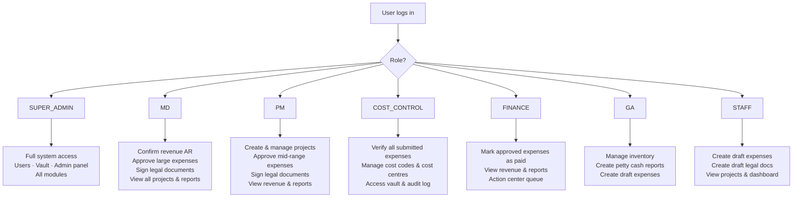
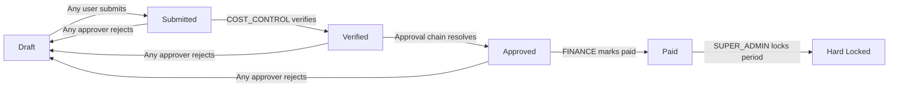
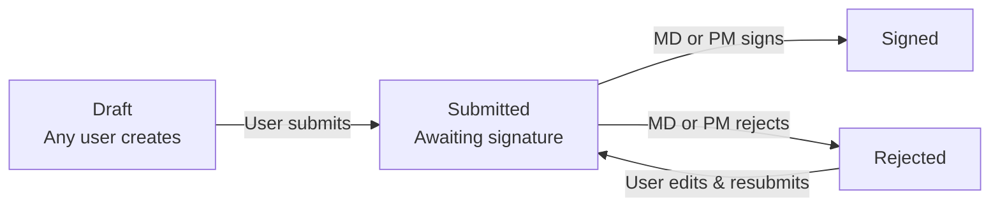

# GPA-ERP — User Roles & Permissions

## Role Definitions

| Role | Description | Typical Person |
|------|-------------|---------------|
| **SUPER_ADMIN** | Full system access. Manages users, menus, approval matrix, vault. Can do everything. | System Administrator |
| **MD** | Managing Director. Final approver on large expenses. Signs legal documents. Confirms AR. | CEO / Managing Director |
| **PM** | Project Manager. Manages projects, approves mid-range expenses, signs some legal docs. | Project Manager |
| **COST_CONTROL** | First verifier on all submitted expenses. Manages cost codes, cost centres. | Cost Control Officer |
| **FINANCE** | Marks approved expenses as paid. Manages financial disbursement. | Finance / Accounting |
| **GA** | General Affairs. Manages inventory in/out, creates petty cash reports. | GA Officer |
| **STAFF** | Basic user. Creates draft expenses, creates draft legal documents. | Any employee |

---

## Module Access Matrix

| Module | SUPER_ADMIN | MD | PM | COST_CONTROL | FINANCE | GA | STAFF |
|--------|:-----------:|:--:|:--:|:------------:|:-------:|:--:|:-----:|
| **Dashboard** | ✅ | ✅ | ✅ | ✅ | ✅ | ✅ | ✅ |
| **Projects** — view | ✅ | ✅ | ✅ | ✅ | ✅ | ✅ | ✅ |
| **Projects** — create/edit/delete | ✅ | ✅ | ✅ | ❌ | ❌ | ❌ | ❌ |
| **Projects** — bulk import (Excel) | ✅ | ✅ | ✅ | ❌ | ❌ | ❌ | ❌ |
| **Revenue (AR)** — view | ✅ | ✅ | ✅ | ✅ | ✅ | ❌ | ❌ |
| **Revenue (AR)** — create/edit | ✅ | ✅ | ✅ | ❌ | ❌ | ❌ | ❌ |
| **Revenue (AR)** — confirm | ✅ | ✅ | ❌ | ❌ | ❌ | ❌ | ❌ |
| **Expenses** — create draft | ✅ | ✅ | ✅ | ✅ | ✅ | ✅ | ✅ |
| **Expenses** — submit | ✅ | ✅ | ✅ | ✅ | ✅ | ✅ | ✅ |
| **Expenses** — verify | ✅ | ❌ | ❌ | ✅ | ❌ | ❌ | ❌ |
| **Expenses** — approve (matrix) | ✅ | ✅ | ✅ | ✅ | ✅ | ❌ | ❌ |
| **Expenses** — mark paid | ✅ | ❌ | ❌ | ❌ | ✅ | ❌ | ❌ |
| **Expenses** — hard lock | ✅ | ❌ | ❌ | ❌ | ❌ | ❌ | ❌ |
| **Petty Cash** — create/manage | ✅ | ✅ | ✅ | ✅ | ✅ | ✅ | ❌ |
| **Legal Docs** — create/edit | ✅ | ✅ | ✅ | ❌ | ❌ | ❌ | ✅ |
| **Legal Docs** — sign/reject | ✅ | ✅ | ✅ | ❌ | ❌ | ❌ | ❌ |
| **Inventory** — view | ✅ | ✅ | ✅ | ✅ | ✅ | ✅ | ✅ |
| **Inventory** — create items / transactions | ✅ | ❌ | ❌ | ❌ | ❌ | ✅ | ❌ |
| **Action Center** (my queue) | ✅ | ✅ | ✅ | ✅ | ✅ | ❌ | ❌ |
| **Reports** | ✅ | ✅ | ✅ | ✅ | ✅ | ❌ | ❌ |
| **Vault** (cost codes, rules, audit) | ✅ | ❌ | ❌ | ✅ | ❌ | ❌ | ❌ |
| **Admin Panel** `/admin` | ✅ | ❌ | ❌ | ❌ | ❌ | ❌ | ❌ |
| **Users** — manage | ✅ | ❌ | ❌ | ❌ | ❌ | ❌ | ❌ |

---

## User Role Flowchart

---

## Expense Approval Workflow

### Approval Chain Resolution

The approval chain is built at submit time from the `approval_rules` table based on:
- Expense **amount** (range matching)
- Expense **cost code category** (Direct, Site, Personnel, Overhead, Other)

Default example matrix:

| Amount Range | Required Approvers (in order) |
|---|---|
| IDR 0 – 50,000 | COST_CONTROL |
| IDR 50,001 – 500,000 | COST_CONTROL → PM |
| IDR 500,001 – 2,000,000 | COST_CONTROL → PM → FINANCE |
| IDR 2,000,001+ | COST_CONTROL → PM → FINANCE → MD |

The chain is stored as JSON on the expense record and is **immutable** once submitted.

---

## Legal Document Workflow

**Document types:**
- `proposal` — Surat Penawaran (SPH/YYYY/###)
- `berita_acara` — Completion Certificate (BA/YYYY/###)
- `surat_jalan` — Delivery Order (SJ/YYYY/###)
- `other` — General Letter (SRT/YYYY/###)

---

## Menu-Based Access Control

In addition to role-based guards, each user has a **per-menu permission toggle** (`UserMenuPermission`). SUPER_ADMIN can grant or revoke individual menu access per user, overriding the role defaults. This allows fine-grained control (e.g. giving a specific STAFF member access to the Reports page).
