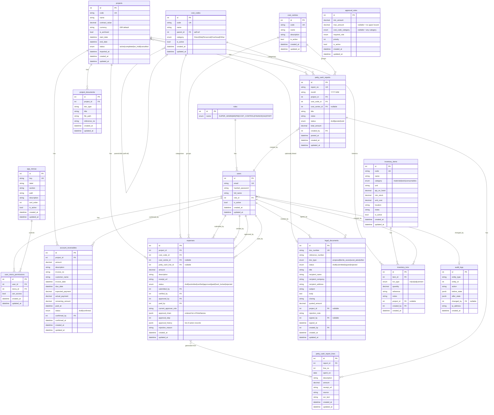

# GPA-ERP — Entity Relationship Diagram

## ERD (Mermaid)

---

## Table Summary

| Table | Rows (expected) | Key Indices |
|---|---|---|
| `roles` | 7 (fixed enum) | `name` UK |
| `users` | Low (10–100) | `email` UK, `role_id` |
| `app_menus` | ~12 (fixed) | `key` UK, `section+sort_order` |
| `user_menu_permissions` | users × menus | `user_id+menu_id` UK |
| `projects` | Medium (10–500) | `code` UK, `status` |
| `cost_codes` | Low (20–200) | `code` UK, self-ref `parent_id` |
| `cost_centres` | Low (5–50) | `code` UK |
| `approval_rules` | Very low (4–20) | `priority`, `is_active` |
| `project_documents` | Medium | `project_id+doc_type` |
| `account_receivables` | Medium (100–10k) | `project_id+status`, `invoice_no` |
| `expenses` | High (1k–100k) | `project_id+status`, `current_approver_role`, `submitted_by` |
| `petty_cash_reports` | Medium | `project_id+month`, `status` |
| `petty_cash_report_lines` | High | `report_id+line_no` |
| `legal_documents` | Low-medium | `doc_number` UK, `status`, `doc_type` |
| `inventory_items` | Low (10–1000) | `code` UK, `category` |
| `inventory_txns` | High | `item_id`, `project_id` |
| `audit_logs` | Very high (append-only) | `entity_type+entity_id`, `changed_by`, `created_at` |
