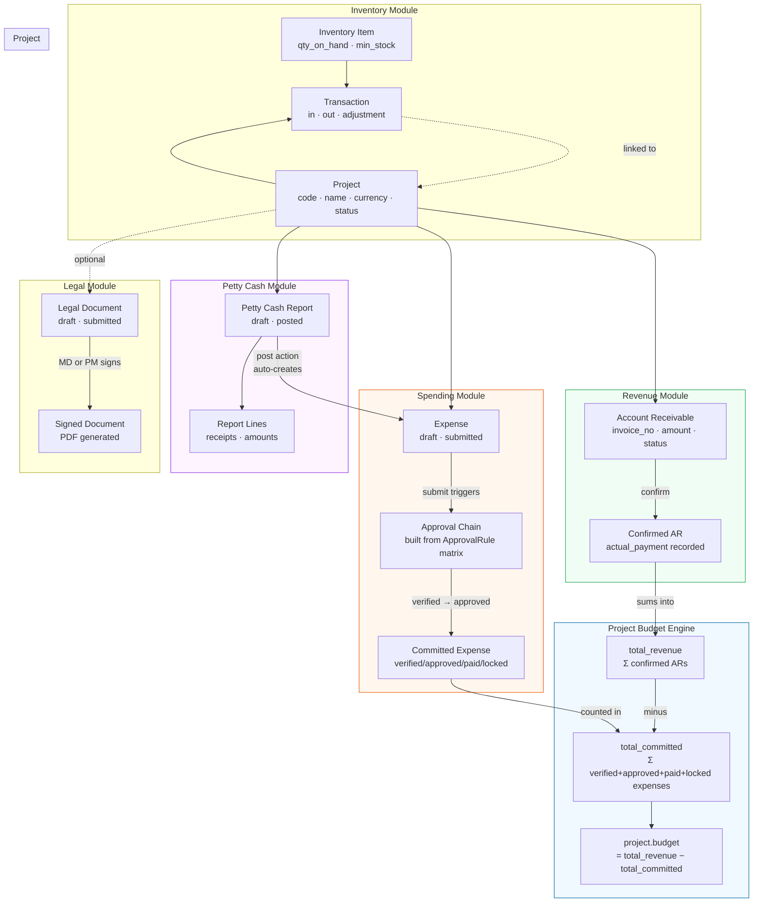
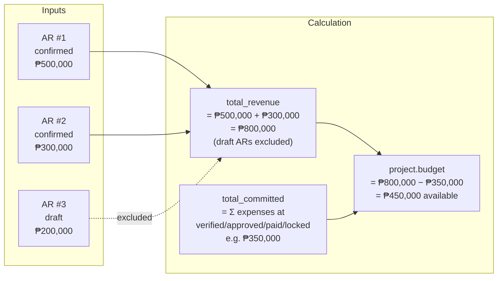
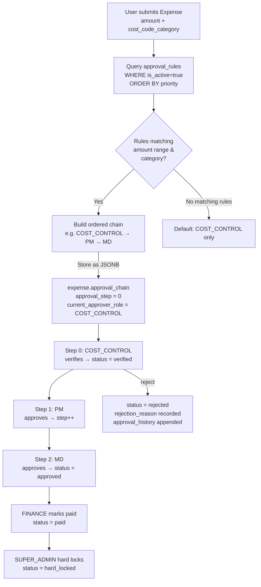
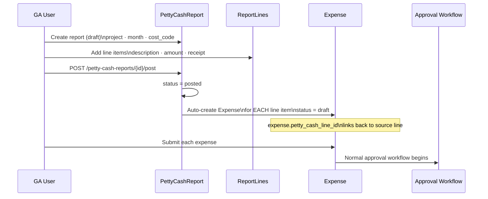
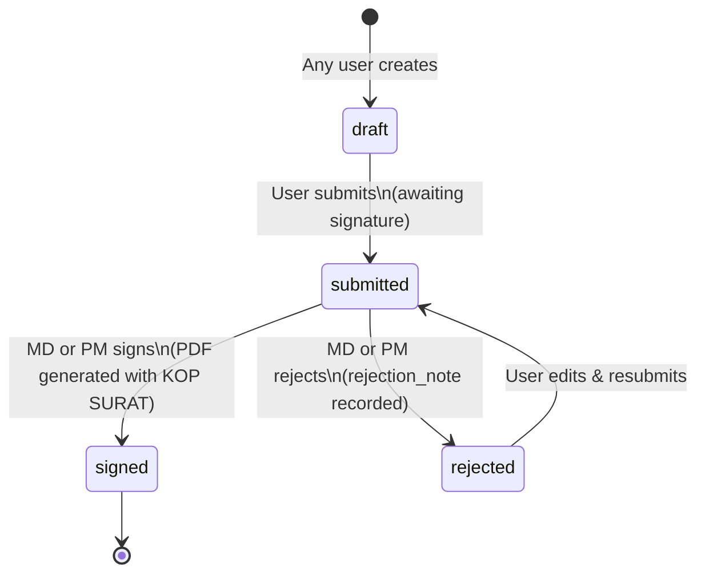
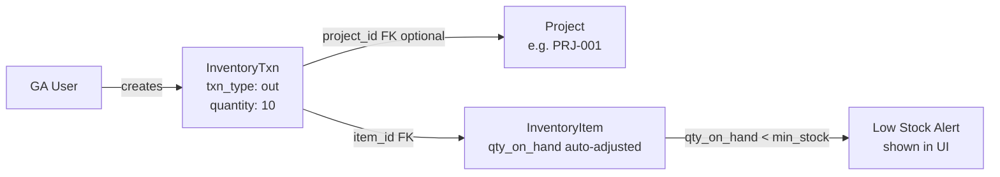
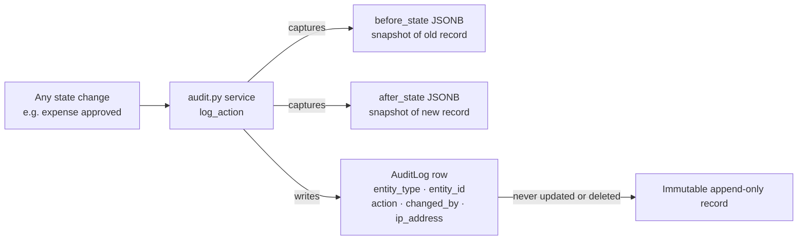

# GPA-ERP — Data Relationship Diagram

This diagram shows how **data flows between modules** — not just foreign key links, but the business logic that connects them.

---

## High-Level Module Flow

---

## Budget Calculation Detail

**Key rule:** Only **confirmed** ARs count toward revenue. Only expenses at `verified`, `approved`, `paid`, or `hard_locked` count toward committed spend. Draft/submitted/rejected expenses do NOT reduce the budget.

---

## Expense Approval Chain Resolution

---

## Petty Cash → Expense Pipeline

---

## Legal Document Lifecycle

---

## Inventory ↔ Project Link

Inventory transactions are **project-linkable but not project-required**. Items consumed on-site can reference a project; warehouse adjustments typically don't.

---

## Audit Trail Flow

The audit log is exposed read-only at `GET /vault/audit-log` and is only accessible to `SUPER_ADMIN` and `COST_CONTROL`.

---

## Cross-Module Data Summary

| Source | Feeds Into | How |
|---|---|---|
| `account_receivables` (confirmed) | `project.total_revenue` | Hybrid property sum |
| `expenses` (verified/approved/paid/locked) | `project.total_committed` | Hybrid property sum |
| `project.total_revenue − total_committed` | `project.budget` | Computed on every read |
| `petty_cash_report_lines` (when report posted) | `expenses` | Auto-created, one per line |
| `approval_rules` (at submit time) | `expense.approval_chain` | Resolved once, stored immutably |
| `inventory_txns` | `inventory_items.qty_on_hand` | Applied by router at transaction create |
| Any state change | `audit_logs` | Via `audit.py` service |
